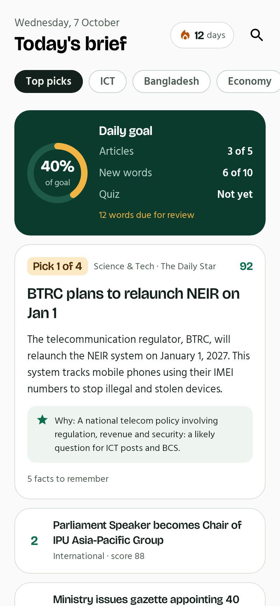
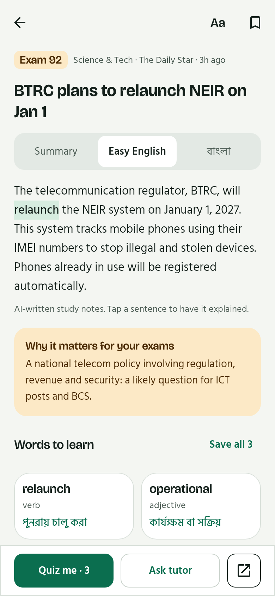
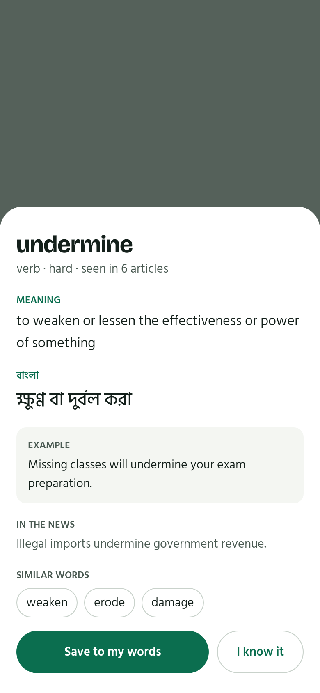
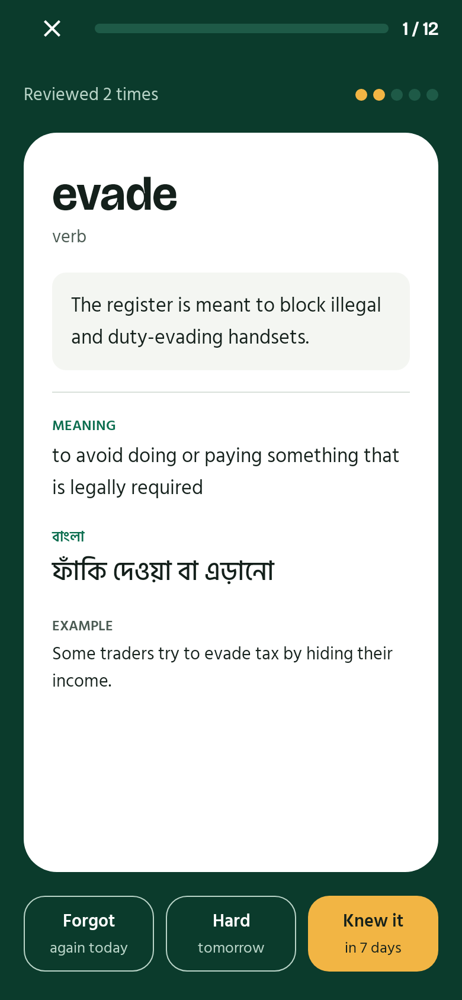
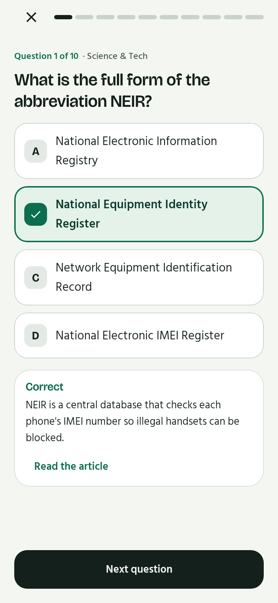
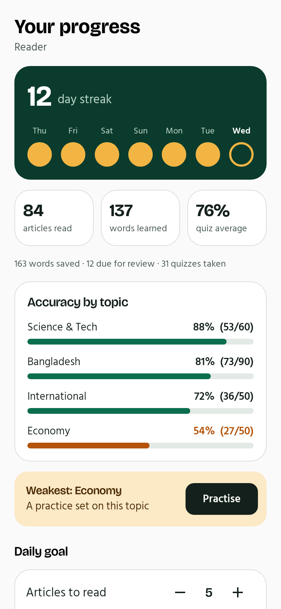
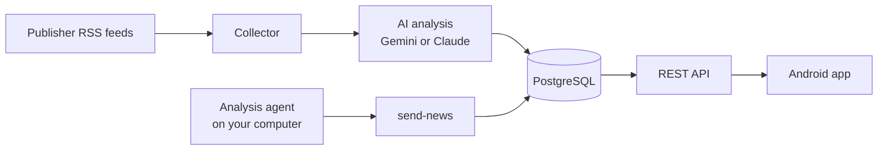

# NewsLearn BD

**Read the news, learn the words, remember the facts.**

NewsLearn BD turns each day's Bangladeshi news into study material for readers who are
improving their English and preparing for government-job exams (BCS, Assistant Programmer,
Assistant Director ICT and similar). Every story becomes an easy-English summary, a Bangla
summary, the difficult words with Bangla meanings, the facts worth memorising, and
exam-style questions, ranked by how much it matters for the exam.

<p align="center">
  
  
  
</p>
<p align="center">
  
  
  
</p>

<p align="center"><sub>
These images are drawn from the app's own screens by an automated test, using sample
content. The article, its words and its question are real output from the pipeline; the
progress numbers are examples.
</sub></p>

## The problem it solves

English newspapers are the best source for current affairs and for building vocabulary,
but two things get in the way:

1. **Too much news.** A day's papers carry a hundred stories. Only a handful matter for
   an exam, and it is hard to tell which.
2. **Vocabulary interrupts reading.** Every unfamiliar word means leaving the article to
   look it up.

NewsLearn BD answers both: it chooses and ranks the stories, and it teaches the words
inside the article you are reading.

## What the app does

| Screen | What you get |
|---|---|
| **Today** | A daily goal ring (articles, new words, quiz) and the day's top picks ranked by exam score, each with the reason it was chosen. Tabs for ICT, Bangladesh, Economy, International and more. |
| **Article** | Three versions of the summary: standard, easy English and বাংলা. Difficult words are highlighted in the text. Tap a word for its meaning; tap a sentence to have it explained. Listen to the summary at normal or slow speed. Key facts, and why the story matters for exams. |
| **Word panel** | Meaning, Bangla meaning, an example, the sentence from the news, similar words and how often the word has appeared. Save it, or mark it "I know it". |
| **Word review** | Flashcards on a spaced schedule: a word you know returns after 1, 3, 7, then 30 days. Three answers: Forgot, Hard, Knew it. |
| **Quiz** | Daily and weekly quizzes, topic practice, quizzes on a single article, and timed mock exams. Each answer is checked and explained as you go; mock exams reveal answers at the end. |
| **Progress** | Your streak across the week, articles read, words learned, quiz average, accuracy by topic, and one-tap practice on your weakest topic. |

Also: a tutor you can ask about any article, daily and weekly current-affairs digests,
saved articles and words, search, and offline reading of anything you have opened.

## How it works



News reaches the database by two routes:

- **Automatically.** A scheduled job reads the publishers' RSS feeds, removes duplicates,
  and sends each new article to a language model once. One call returns the category,
  three summaries, vocabulary, facts, an exam-importance score and questions, validated
  against a schema before anything is stored.
- **From your own analysis agent.** An AI agent on your computer can read the day's papers,
  pick what matters, and write its notes as JSON files. `./send-news` checks them and
  stores them. The method and format are in [`agent-data/`](agent-data).

The app only ever shows study notes and a link to the original. Article text is not stored
long-term and is never served.

## Built with

| Part | Technology |
|---|---|
| Android app | Kotlin, Jetpack Compose (Material 3), MVVM, Coroutines and Flow, Retrofit, Room, DataStore |
| Backend | Python, FastAPI, SQLAlchemy 2, Alembic, PostgreSQL |
| AI | Google Gemini or Anthropic Claude behind one interface, with a free offline mock for development |
| Hosting | Render (API), Neon (database), GitHub Actions (scheduled news pipeline and CI) |

## Repository

| Folder | Contents | Start here |
|---|---|---|
| [`android/`](android) | The app | [android/README.md](android/README.md) |
| [`backend/`](backend) | The API, the news collector and the AI pipeline | [backend/README.md](backend/README.md) |
| [`agent-data/`](agent-data) | Hand-over folder for the analysis agent: its method, the data format, an example | [agent-data/README.md](agent-data/README.md) |
| [`docs/`](docs) | Plans, decisions and the deployment guide | [docs/PLAN.md](docs/PLAN.md) |

## Getting started

**Try the app.** Download the latest APK from
[Releases](../../releases) and install it on an Android phone (Android 8 or newer).

**Run the backend locally.** It works out of the box with SQLite and the mock AI:

```bash
cd backend
python3 -m venv .venv && . .venv/bin/activate
pip install -e ".[dev]"
alembic upgrade head
python -m app.cli seed && python -m app.cli collect && python -m app.cli process
uvicorn app.main:app --reload      # http://localhost:8000/docs
```

**Build the app.** Open `android/` in Android Studio, or:

```bash
cd android && ./gradlew assembleDebug
```

**Put it online.** [docs/DEPLOY.md](docs/DEPLOY.md) walks through Neon, GitHub Actions and
Render, all on free tiers.

**Send your own analysis.** Give your agent the three files in [`agent-data/`](agent-data),
then run `./send-news`.

## Quality

- **Backend:** 59 tests, run on both SQLite and PostgreSQL.
- **App:** 19 tests. A contract test decodes responses captured from the real backend, and
  screen tests draw every main screen and walk its main path.
- Both run on every push ([Actions](../../actions)).

## Good to know

- **AI quota.** On Gemini's free tier the automatic pipeline analyses about 20 articles a
  day. It stops cleanly when the quota is spent and resumes the next day. A daily spending
  cap applies on paid plans.
- **AI-written notes can be wrong.** Summaries and questions are generated; the app labels
  them and always links to the original article.
- **Sources.** Only publishers' own RSS feeds and public pages are read automatically, and
  robots.txt and crawl delays are respected.

## Credits

Typefaces: [Bricolage Grotesque](https://github.com/ateliertriay/bricolage) and
[Hind Siliguri](https://github.com/itfoundry/hind-siliguri), both under the SIL Open Font
License ([licences](android/licenses)).
